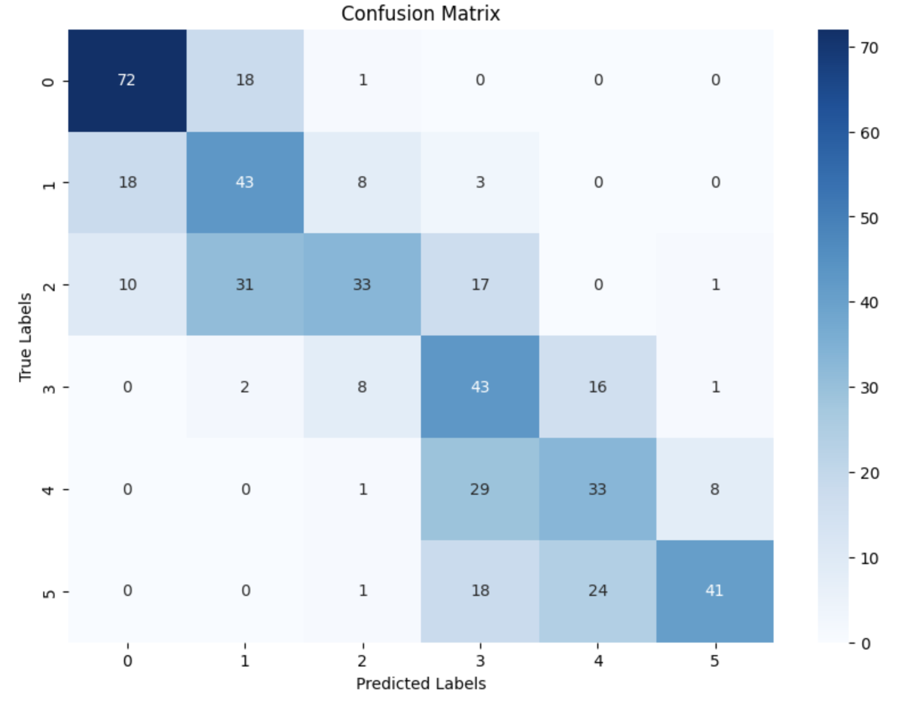

# Data Mining & Machine Learning

## Project: Detecting the Difficulty Level of French Texts

### Group: Microsoft

#### Participants:
- Abderazzak Saib
- Ajiach Nabil

#### Description:
As described above in the project's Title, the main goal of this Kaggle competition is to predict the difficulty level of a French text according to The Common European Framework of Reference for Languages that describes 6 levels of language: A1, A2, B1, B2, C1, C2.

You can find all information and rules on this Kaggle link: [Kaggle Competition](https://www.kaggle.com/competitions/detecting-french-texts-difficulty-level-2023/overview)

#### Our Youtube Video 
[Watch the video](#https://youtu.be/Y12_XP3deXM)

#### Dataset Description
- `training_data.csv` -> the training set (with sentence and respective difficulty)
- `unlabelled_test_data.csv` -> the test set (with just sentence)
- `sample_submission.csv` -> submission of our prediction with only id and difficulty

#### Columns
- `id`: Numerical identifier of the sentence.
- `sentence`: A sentence in French for which you want to predict the difficulty level.
- `difficulty`: The difficulty level of the sentence (from A1 to C2). This column would be your target variable.

#### Approach
1. **Installing the Necessary Packages**
   - For language support: `spacy`, `nltk`, `sentencepiece`,`transformers datasets pandas sickit-learn` etc...
   - For modelling: `pandas`, `numpy`, `sklearn`, `torch` etc...

2. **Models**
   - The Models we used in our analysis:
     - Logistic regression
     - KNN
     - Decision Tree
     - Random Forest models
     - CamemBERT
     - FlauBERT

#### Data Exploration and Cleaning

Before embarking on the model training journey, we invested significant effort into thoroughly exploring the dataset. This initial step is crucial as it informs subsequent decisions about data preprocessing and model selection.

## Key Observations:

- **Well-Distributed Values**: Our analysis revealed that the dataset was well-balanced across different difficulty levels. This balance is crucial in machine learning, especially for classification tasks, as it prevents model bias towards more frequent labels.

-**Distribution of Sentence Lengths by Difficulty Level** also our analysis, illustrated in the box plot, indicates a wide range of sentence lengths across different difficulty levels. Notably, the higher difficulty levels (B2 and C2) show a greater spread in sentence length, which may suggest a more complex sentence structure or vocabulary usage.

- **Quality of Data**: We examined the dataset for common issues such as missing values and duplicates. To our advantage, the dataset maintained a high standard of quality, with minimal anomalies that could potentially skew the model's performance.

- **Consistency in Labeling**: The labels for text difficulty followed a consistent pattern, reducing the need for label encoding or correction.
  
- **Textual Data Analysis**: Given that our dataset consists of textual data, we checked for language consistency, and the presence of special characters or noise. The texts were uniformly in French, with standard language use and minimal noise, which is ideal for natural language processing tasks.

## Decision on Data Cleaning:
Based on these observations, we concluded that extensive data cleaning or balancing was not necessary for our project. This finding allowed us to channel our efforts more effectively towards feature engineering and model tuning. 

####Model Training and Hyperparameter Optimization

This section documents the process of training several machine learning models, including the hyperparameter optimization for each, and provides a comparative analysis of their performance based on several metrics.

## Logistic Regression

### Hyperparameter Tuning

**Tuned Hyperparameters:**
- `C`: Inverse of regularization strength tested over [1, 10, 100].
- `solver`: Optimization algorithms tested [‘lbfgs’, ‘saga’].

**Optimization Method:** Grid Search with 5-fold cross-validation.

**Best Hyperparameters:**
- `C`: 10
- `solver`: lbfgs

**Results**
- Best Accuracy Score: 0.476

## k-Nearest Neighbors (kNN)

### Hyperparameter Tuning

**Tuned Hyperparameters:**
- `n_neighbors`: Number of neighbors tested over [5, 7].

**Optimization Method:** Random Search with 5-fold cross-validation.

**Best Hyperparameters:**
- `n_neighbors`: 5

**Results**
- Best Accuracy Score: 0.3187

## Decision Tree

### Hyperparameter Tuning

**Tuned Hyperparameters:**
- `max_depth`: The maximum depth of the tree tested over [1-26].

**Optimization Method:** Grid Search with 5-fold cross-validation.

**Best Hyperparameters:**
- `max_depth`: 16

**Results**

- Best Accuracy Score: 0.3104

## Random Forests

### Hyperparameter Tuning

**Tuned Hyperparameters:**
- `n_estimators`: Number of trees in the forest tested over [300, 400].

**Optimization Method:** Grid Search with 5-fold cross-validation.

**Best Hyperparameters:**
- `n_estimators`: 400

**Results**
- Best Accuracy Score: 0.3812

## CamemBERT Model

### Hyperparameter Tuning

**Tuned Hyperparameters:**
- `learning_rate`: Tested over [1e-4, 5e-5, 2e-5].
- `num_train_epochs`: Tested [3, 5, 7].
- `batch_size`: Tested [8, 16, 32].

**Optimization Method:** AdamW.

**Best Hyperparameters:**
- `learning_rate`: 5e-5
- `num_train_epochs`: 3
- `batch_size`: 16

**Cross-Validation Results**
- Best Accuracy Score: 0.59

## FlauBERT Model

### Hyperparameter Tuning

**Tuned Hyperparameters:**
- `learning_rate`: Tested over [1e-4, 5e-5, 2e-5].
- `num_train_epochs`: Tested [3, 5, 7].
- `batch_size`: Tested [8, 16, 32].

**Optimization Method:** Manual Iterative Search.

**Best Hyperparameters:**
- `learning_rate`: 5e-5
- `num_train_epochs`: 3
- `batch_size`: 16

**Cross-Validation Results**
- Best Accuracy Score: 0.62

## Comparative Analysis

The performance of each model was evaluated based on precision, recall, F1-score, and accuracy. The following table summarizes the results without doing any cleaning on the data:

| Model               | Precision | Recall | F1-score | Accuracy |
|---------------------|-----------|--------|----------|----------|
| Logistic Regression | 0.4756    | 0.4760 | 0.4702   | 0.4760   |
| kNN                 | 0.3902    | 0.3187 | 0.2948   | 0.3187   |
| Decision Tree       | 0.3139    | 0.3104 | 0.3029   | 0.3104   |
| Random Forests      | 0.3966    | 0.3812 | 0.3593   | 0.3812   |
| CamemBERT           | 0.5932    | 0.5743 | 0.5734   | 0.5943   |
| FlauBERT Model      | 0.6192    | 0.6202 | 0.6021   | 0.6202   |

### Best Model

Based on the above metrics, the best performing model is the **FlauBERT Model**. This determination is based on the highest overall accuracy and balanced precision and recall, which are critical factors for our specific use-case of text classification.

## 4. Submission
- We use our best model on the file 'unlabelled_test_dat.csv', convert it to the same format as in the file 'sample_submission.csv', download in CSV format, and submit on Kaggle (it gave us a score of 0.629).

## 6. Accuracy Improvement 

### Selection of Diverse Models
We selected five distinct NLP models, each renowned for its capabilities in language understanding. These included different versions and configurations of models like Flaubert and Camembert, specifically tailored for the French language.

### Individual Predictions
Each model was tasked with predicting language difficulty levels on the same set of data. This step ensured that we gathered diverse opinions from each model, considering their unique learning and prediction patterns.

### Data Consolidation
Predictions from all models were consolidated into a single dataset. This dataset included the unique identifier for each data point (`id`) and the predicted difficulty level from each model.

### Majority Voting Mechanism
We applied a majority voting system to this consolidated dataset. For each data point, we identified the most frequently predicted difficulty level among the models. This approach allowed us to leverage the collective wisdom of all models, reducing the impact of any individual model biases or errors.

### Final Predictions Compilation
The most common predictions across models were compiled into a final dataset, providing a robust and well-rounded prediction for each data point.

### Advantages of This Method

- **Reduced Bias:** By combining predictions from multiple models, we mitigate the bias inherent in any single model.
- **Enhanced Accuracy:** The majority voting system tends to favor the most reliable and consistent predictions, enhancing overall accuracy.
- **Diverse Perspectives:** Different models may excel in various aspects of language understanding, and this method capitalizes on these diverse strengths.

In conclusion, this ensemble approach, grounded in the principle of majority voting, marks a significant step towards more reliable and accurate language difficulty predictions. By harmonizing the insights of multiple NLP models, we aim to provide predictions that are not only accurate but also robust and dependable.

## 7. Model Improvement
To improve our model we consider these two approaches; 

-Fine-Tune Hyperparameters:
would conduct a more comprehensive hyperparameter optimization, particularly focusing on the learning rate, batch size, and the number of training epochs.
Utilize advanced techniques like Bayesian optimization for a more efficient search through the hyperparameter space, aiming to find the optimal combination that maximizes model performance.
Expand and Refine Preprocessing:

-Implement advanced text preprocessing techniques: 
This would include lemmatization to reduce words to their base or dictionary form, and custom tokenization to better capture the nuances of the French language.
Explore data augmentation strategies like synonym replacement or back-translation (translating text to another language and back) to generate additional training data, which can be particularly helpful in improving the model's robustness and handling of diverse sentence structures.

(https://www.kaggle.com/competitions/detecting-french-texts-difficulty-level-2023/overview)
